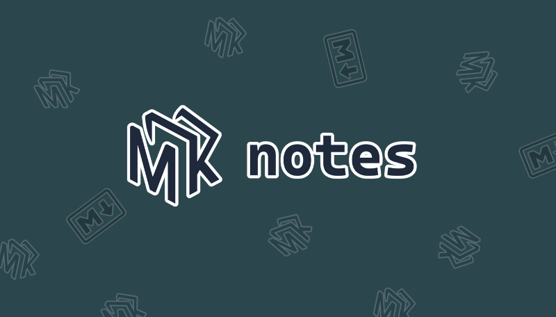

Sync your <b>Markdown files</b> to <b>Notion</b> in a single command

 

    
    
    
    
    
    

 

## Documentation 📚

Visit the [official documentation](https://docs.mk-notes.io) to learn more about Mk Notes.

## Community 📣

- **Discord Server**: [Join our Discord](https://discord.gg/AuVGNnyMfQ)

 

### Want to Contribute? 💪

If you want to file a bug or submit a PR, read up on
our [guidelines for contributing](https://github.com/Myastr0/mk-notes/blob/master/CONTRIBUTING.md)
